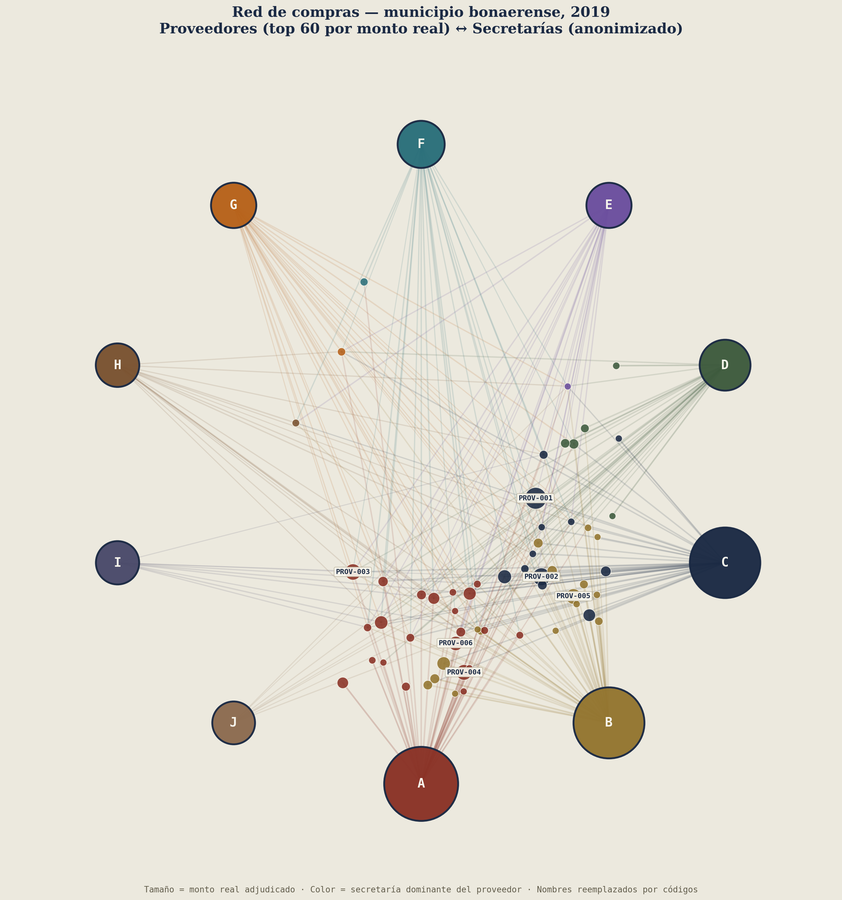

# Boletín de Compras Municipales · Chascomus 2019

**Auditoría de calidad de datos, análisis de compras públicas y análisis de redes sociales (ARS), sobre el registro de órdenes de compra 2019.**

> 🔒 **Nota de privacidad:** este repositorio es un ejercicio de portfolio a partir de trabajo real. Los nombres de proveedores y de secretarías fueron reemplazados por códigos (`PROV-XXX` / `Secretaría A`–`J`), y el municipio no se identifica por nombre. Las proporciones, montos, fechas y estructura de la red son reales — solo se anonimizaron las identidades.

🔗 **[Ver el dashboard interactivo](https://gdaguerre-dot.github.io/chascomus-compras-2019/)**



---

## Por qué este proyecto

Trabajé con esta base como parte de mi paso por la Dirección de Modernización de un municipio bonaerense. Tomé el mismo registro que había sustentado un informe previo de análisis de redes sociales (ARS) sobre las compras municipales de 2019, y le apliqué un proceso de auditoría de calidad de datos, reconstrucción de series reales, un tablero de transparencia con filtros interactivos, y una reconstrucción anonimizada del grafo de red — como ejercicio de portfolio para mostrar el circuito completo: **de un archivo de gestión municipal crudo a un producto de datos usable, sin exponer información identificable.**

## El hallazgo principal

La base cruda **repite el importe total de cada orden de compra en cada línea de detalle** que la compone (una orden con 5 ítems aparece 5 veces con el mismo monto). Sumar la columna `IMPORTE` sin corregir esto **infla el gasto real en 2,38x**:

| | Monto |
|---|---|
| Suma cruda de la columna IMPORTE | $1.012.868.439 |
| **Gasto real 2019 (corregido)** | **$426.096.932** |

Además, el número de orden de compra (folio) **solo está completo en el 29,4% de las líneas** — se reconstruyó con relleno hacia adelante (forward-fill), asumiendo que cada línea de detalle hereda el folio de la primera fila de su orden. A partir de fines de abril de 2019 el campo prácticamente deja de cargarse, lo que sugiere una falla de trazabilidad en el proceso de carga, no un dato faltante al azar.

Ver la metodología completa en [`docs/index.html`](docs/index.html) (sección "Nota sobre calidad de datos").

## Cómo se anonimizó

| Dato original | Tratamiento |
|---|---|
| Nombre de secretaría | Reemplazado por `Secretaría A`–`J`, ordenadas por gasto real descendente (A = mayor gasto) |
| Nombre/razón social de proveedor | Reemplazado por código `PROV-001`…`PROV-616`, ordenados por gasto real descendente |
| Número de folio de orden real | Reemplazado por un ID sintético secuencial (`OC-00001`…), sin relación con el folio original |
| Dependencia de detalle (nivel más fino que secretaría) | Descartada de los archivos públicos — no se usa en el dashboard ni en la red |
| Nombre del municipio | No se publica; se referencia como "municipio bonaerense" |

El mapeo real → código se generó una sola vez y se usó de forma consistente en todos los archivos (CSV, dashboard y red), pero **no se publica** — queda excluido del repositorio (ver `.gitignore`). Esto es intencional: el objetivo es mostrar el proceso y la estructura, no permitir revincular los códigos con proveedores reales.

## Qué contiene el repositorio

```
├── data/
│   └── compras_2019_anonimizado.csv   # una fila por orden real, anonimizada (13.715 filas)
├── docs/
│   ├── index.html                      # dashboard interactivo (GitHub Pages)
│   └── fine_data.js                    # datos agregados anonimizados (secretaría × mes × proveedor)
├── assets/
│   └── red_compras_2019.png            # red proveedor–secretaría, anonimizada
├── scripts/
│   ├── clean_and_aggregate.py          # diagnóstico de calidad de datos (opera sobre el archivo fuente, no publicado)
│   ├── anonymize.py                    # limpieza + anonimización + agregación reproducible
│   └── build_network_graph.py          # generación del grafo de red anonimizado
└── README.md
```

**No se incluye el archivo fuente original** (tiene nombres reales de proveedores y secretarías). Los scripts que lo requieren (`clean_and_aggregate.py`, `anonymize.py`) están documentados igual, para mostrar el método, pero solo pueden correrse con el archivo original en un entorno local — no se publica ni se necesita para ver el dashboard.

## El dashboard

- **KPIs y monto real vs. inflado**, con la corrección de datos como pieza central, no como nota al pie.
- **Filtro interactivo por secretaría** (por letra): al hacer clic en cualquier fila de la sección "Gasto por secretaría", todo el tablero (KPIs, gasto mensual, ranking de proveedores) se recalcula, calculado en el navegador a partir del set agregado — sin backend ni datos reales expuestos.
- **Índice de concentración de proveedores (HHI)** por secretaría, con semáforo bajo / moderado / alto.
- **Ranking de proveedores** por código, por monto real adjudicado.
- **Red proveedor–secretaría** anonimizada, como puente con el informe ARS original.

## La red proveedor–secretaría

`assets/red_compras_2019.png` reconstruye la red bimodal del informe original con un layout radial: las 10 secretarías (por letra) se ubican en el anillo exterior; los 60 proveedores de mayor adjudicación real (por código) se agrupan cerca de su secretaría dominante, y se acercan al centro cuanto más secretarías distintas les compraron. El tamaño del nodo es proporcional al monto; el color, a la secretaría dominante del proveedor.

Se regenera con:

```bash
python scripts/build_network_graph.py data/compras_2019_anonimizado.csv
```

## Cómo reproducir todo desde cero

Requiere el archivo fuente original (no publicado, por privacidad):

```bash
pip install pandas openpyxl matplotlib numpy

# 1) Diagnóstico de calidad de datos (opcional, solo imprime el reporte)
python scripts/clean_and_aggregate.py data/orden_compra_2019_original.xlsx

# 2) Limpieza + anonimización + agregación (genera data/compras_2019_anonimizado.csv y docs/fine_data.js)
python scripts/anonymize.py data/orden_compra_2019_original.xlsx

# 3) Grafo de red (genera assets/red_compras_2019.png)
python scripts/build_network_graph.py data/compras_2019_anonimizado.csv

# 4) Ver el dashboard localmente
cd docs && python -m http.server 8000
# abrir http://localhost:8000
```

Sin el archivo fuente, los pasos 3 y 4 igual funcionan a partir de `data/compras_2019_anonimizado.csv`, que sí está en el repo.

## Limitaciones y lo que queda abierto

- La deduplicación por (orden, proveedor, importe) es una reconstrucción razonable pero no perfecta: si dos compras distintas de un mismo proveedor el mismo día coincidieran en el importe exacto, se contarían como una sola.
- No hay forma, con este export, de saber *por qué* dejó de cargarse el folio de orden desde fines de abril de 2019.
- Las cifras están en pesos argentinos corrientes de 2019 (sin ajuste por inflación).
- Los códigos de proveedor y secretaría son estables *dentro de este repositorio* pero no tienen ningún significado fuera de él.

## Contexto

Este proyecto complementa (de forma anonimizada) un informe previo de análisis de redes sociales aplicado a la misma base 2019, que trabajó con foco en centralidad, intermediación y modularidad de la red secretaría–proveedores, identificando tres secretarías como comunidades centrales del organigrama municipal — el mismo patrón de concentración que se puede verificar acá con el gasto real.
